<div align="center">
  <h1>🎯 ATS Score Checker</h1>
  <p><strong>AI-powered resume optimization tool for job seekers</strong></p>
  
  <a href="https://ats-score-checker-ranajoy.streamlit.app/">
    
  </a>
  <br><br>
  
  
  
  
  
</div>

---

## 📖 About

An intelligent ATS Score Checker that helps job seekers optimize their resumes for Applicant Tracking Systems. Get detailed feedback, improve keyword density, and increase your chances of passing initial resume screening.

> **🌟 [Try the Live Demo](https://ats-score-checker-ranajoy.streamlit.app/)**

## ✨ Key Features

<table>
  <tr>
    <td>🔍 <strong>Smart Analysis</strong></td>
    <td>Comprehensive evaluation of resume against job descriptions</td>
  </tr>
  <tr>
    <td>📊 <strong>ATS Scoring</strong></td>
    <td>Instant compatibility score with detailed feedback</td>
  </tr>
  <tr>
    <td>🎯 <strong>Keyword Optimization</strong></td>
    <td>Identify missing keywords and improvement suggestions</td>
  </tr>
  <tr>
    <td>📄 <strong>Format Check</strong></td>
    <td>Ensure your resume format passes ATS parsing</td>
  </tr>
  <tr>
    <td>🎪 <strong>Match Analysis</strong></td>
    <td>See alignment between resume and job requirements</td>
  </tr>
  <tr>
    <td>💡 <strong>Actionable Tips</strong></td>
    <td>Specific recommendations for resume improvement</td>
  </tr>
</table>

## 🛠️ Technical Stack

<div align="center">
  
| Component | Technology | Performance |
|-----------|------------|-------------|
| **AI Model** | Gemma-3 27B | Intelligent Analysis |
| **Frontend** | Streamlit | Interactive UI |
| **API Rate** | 30 req/min | High Performance |
| **Daily Limit** | 14,400 requests | Scalable |
| **Token Processing** | 15,000/min | Fast Response |

</div>

## 🚀 Quick Start

### 1. Clone Repository
```bash
git clone https://github.com/rono-007/Ats-Score-Checker.git
cd Ats-Score-Checker
```

### 2. Install Dependencies
```bash
pip install -r requirements.txt
```

### 3. Set Environment Variables
```bash
# Create .env file with your API keys
API_KEY=your_gemma_api_key_here
```

### 4. Run Application
```bash
streamlit run app.py
```

## 🎯 How to Use

```mermaid
graph LR
    A[📄 Upload Resume] --> B[📋 Add Job Description]
    B --> C[🔍 Get Analysis]
    C --> D[📊 View Score & Feedback]
    D --> E[✏️ Optimize Resume]
    E --> F[🔄 Re-test]
```

<div align="center">
  


</div>

1. **Upload Resume**: Support for PDF and text formats
2. **Job Description**: Paste the target job description
3. **Analysis**: Get detailed ATS compatibility score
4. **Optimization**: Follow specific recommendations
5. **Re-testing**: Verify improvements

## 📦 Project Structure

```
Ats-Score-Checker/
├── app.py                 # Main Streamlit application
├── requirements.txt       # Python dependencies
├── README.md             # Project documentation
├── .env                  # Environment variables
├── utils/
│   ├── analyzer.py       # Resume analysis logic
│   └── scorer.py         # ATS scoring algorithms
└── assets/
    └── images/           # Application screenshots
```

## 🤝 Contributing

We welcome contributions! Here's how you can help:

1. **Fork** the repository
2. **Create** a feature branch (`git checkout -b feature/amazing-feature`)
3. **Commit** your changes (`git commit -m 'Add amazing feature'`)
4. **Push** to the branch (`git push origin feature/amazing-feature`)
5. **Open** a Pull Request

## 📄 License

This project is licensed under the **MIT License** - see the [LICENSE](LICENSE) file for details.

## 🌟 Show Support

If this project helped you land your dream job, please:
- ⭐ **Star** this repository
- 🍴 **Fork** it for your own use
- 🐛 **Report** any issues
- 💡 **Suggest** new features

📧 Contact & Support
<div align="center">
Show Image
Show Image
</div>

<div align="center">
  <strong>Built with ❤️ to help job seekers succeed in their career journey</strong>
  <br><br>
  <a href="https://ats-score-checker-ranajoy.streamlit.app/">
    
  </a>
</div>
